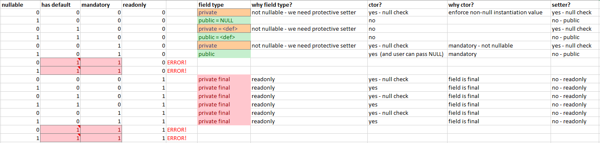

# Swagger Codegen for Keytiles model files

## Overview

Contains customized generator for https://github.com/swagger-api/swagger-codegen - based on the original JavaClientCodegen

Project skeleton was created following https://github.com/swagger-api/swagger-codegen/#making-your-own-codegen-modules instructions.

## Licensing

This code comes with [Apache License 2.0](https://opensource.org/licenses/Apache-2.0)

## Releases

You can check the [CHANGELOG.md](CHANGELOG.md) file for details.

## Model generation 

### <a name="global_differences"></a>Global differences compared to standard Java rendering

The following are happening globally:
* by default we use `library=resttemplate` option (which is using Jackson library style)
* **@Schema**, **@ApiModel**, **@ApiModelProperty** and similar annotations are removed from generated model classes - so dependency `io.swagger.core.v3:swagger-annotations` is not needed anymore to use the model classes
* **@javax.*** annotations are also removed from generated model classes
* `serializableModel` is turned on by default (model classes are implementing `Serializable` interface). But you can overcome this with adding option `serializableModel=false`
* <a name="global_differences_ignoreimportmapping"></a>`ignoreImportMapping` option is defaulted to `false` - at least in the beginning... (see my comment: https://github.com/swagger-api/swagger-codegen/issues/10419#issuecomment-1184578892) But it is enough to get the <importMappings> option working and collect models. Of course this would not block generate models we dont want/need so option `excludeImportMappingsFromGeneration` is also introduced.
* if you use `importMappings` then a strict rule was introduced: it is not allowed to define model with the same name which is also present in the imports
* several extra OpenApi `x-` tags are available to drive model generation on a "hint" basis - see section [OpenApi 'x-' tags](#opeanapi_x_tags) for more details!
* added support to use primitive types in models instead of always using wrapper classes - see [option usePrimitiveTypesIfPossible](#option_useprimitivetypesifpossible)
* handling of referred in (using `$ref`) objects/enums is enhanced - now the attributes of the referred object (if has any) like `nullable` or `default` is considered and not just simply ignored - in line with [OpenApi v3 spec, "$ref and Sibling Elements" section](https://swagger.io/docs/specification/using-ref)
* schema validation is enhanced so model generation will break in cases which does not make any sense, e.g. if a) someone writes a schema in which he tries to extend an Enum (using `allOf`) or b) one makes an object property `mandatory=true` and also assignd a `default` value (as this is contradicting information due to OpenApi spec)
* however extending an Enum is not possible (in Java for sure) we added support for using composition of Enums - see [Support for Enum composition](#enum_composition)
* support is added to give Array fields default value - see [Support for Array fields default value](#array_default)
* Enum renames based on "common prefix" in the name mechanism is turned off - it is causing confusion and breaks.


### <a name="option_modelstyle"></a>option 'modelStyle'

An option named `modelStyle` is available to fine tune model rendering style. Using this is optional.

**note:** If you are using the swagger-codegen-maven-plugin you can add this to `<configOptions>` section!

#### value 'inherited'

In this case not much happens compared to the underlying Java rendering just what is already documented above in the 'Global differences compared to standard Java rendering' section

#### value 'simpleConsistent' (default)

With this model generation style you get generated models highly respects the contract (the OpenApi schema). Property modifiers like `required`, `readOnly: true`, `nullable` and `default` declarations become very important!

The main goal is: to get a simplified (e.g. no unnecessary setters/getters but make the field public) but enforced consistency (instantiation of a model class via non-zero argument constructor - if needed) in the generated models.

This approach brings closer the written code (which is working with the models) with the defined OpenApi contracts and while we are writing the code - thanks to the enforced consistency - we might get into situations more likely we realize the model is not good enough / not behaves as expected and contract should be modified / fine tuned maybe?

As a side effect when we change the contract and regenerate the models it might lead to compile errors quickly in your code - showing clearly which parts the current code (working with the models) need adjustments.

<a name="simpleconsistent_rules"></a>
The following table is showing/summarizing how the logic works under the hood considering the `required`, `readOnly: true`, `nullable` and `default` modifiers.



(note: you can find this in an attached [Excel sheet](docs/cases-considerations.xlsx) too)

The name of the generation "simple" and "consistent" comes from the above rules which:
* guarantee strong(er) **consistency** between schema contract and model usage from code
* by introducing making fields public whenever possible AND removing every non-absolutely-necessary @annotations from the model are **simplifying** the model / dependencies you need to pull in heavily

**Please note!** As a consequence of the above rules if you declare all properties in an Object in the schema "readOnly: true" then
basically an immutable model will be generated... (note: again a nice future feature could be to support builder generation too for these or similar cases)

### <a name="option_keeppropertynames"></a>option 'keepPropertyNames'

This is a boolean option. Default: false

The original Java rendering is transforming field names into java style camel case. Which is in most of the cases totally fine however
sometimes is screwing up model readability... e.g. a field named 'g_tId' is changed to 'gTId'.

If you don't want that and you are writing your OpenApi schema due to Java naming standards already you might want this not happening.
In this case you can use this option - which is a boolean option

**note:** You also have the possibility to control this behavior on Object or even on Property level in the schema using the
`x-keytiles-keep-property-names` / `x-keytiles-keep-property-name` flags!

### <a name="option_allowrenameconflictingfields"></a>option 'allowRenameConflictingFields'

This is a boolean option. Default:
 * true for `modelStyle=inherited` (maintain backward compatibility)
 * false for `modelStyle=simpleConsistent`

This flag controls if it is allowed to the Codegen to rename a property in a Subclass which conflicts (conflict = same name but different data type) or not - so fail the build instead and let user re-think about his schema.

There are some cases when your contract simply can not be generated into Java models which would compile. See [Java limitations with generating models](#java_limitations) for more info!

The original Java Codegen has a mechanism to recognize these cases and it applies a simple solution for that: it simply renames the field of the Subclass by prepending the field name with the name of the Subclass.

Well this definitely solves the problem of the Codegen itself :-) And even marshalling to / unmarshalling from e.g. a JSON representation of the model will work correctly (thanks to @JsonProperty annotations). But the model would just look strange...

For example: Working with a Subclass from your code will be confusing because it will have a) the renamed property and its setter/getter methods b) but will also have the original ones inherited from the Superclass. This definitely creates confusion and can even lead to misuse the models and therefore simply generate a wrong JSON at the end! (e.g. if someone is loading value into the Superclass field instead of the renamed one then JSON simply will be wrong)

Doing a property auto-rename is simply contradicting with the intentions of the "consistent" part of "simpleConsistent" - this is why by default in this model style this is not allowed.

note: if you allow Codegen to do this thing then in "simpleConsistent" model style if [addExplanationsToModel](#option_addexplanationstomodel) is turned on then Codegen will mark these fields for you.


### <a name="option_addexplanationstomodel"></a>option 'addExplanationsToModel'

This is a boolean option. Default: false

This is a very useful debugging feature! The generator in modelType=simpleConsistent generation is making decisions based on [complex rules](#simpleconsistent_rules). And it might not be obvious e.g. while a property became `private` or `private final` field? Then turn this on!

This will add `// @Generator` comments to model class fields, methods and constructor to understand better why the generator made decisions.


### <a name="option_useprimitivetypesifpossible"></a>option 'usePrimitiveTypesIfPossible'

This is a boolean option. Default: false

If set to true then this gives a "strong wish" to the generator it should try to use primitive datatypes whenever it is possible. After this point the generator will follow [certain rules and considerations](#useprimitivetypes_rules) to achieve this.

#### <a name="using_primitive_types"></a>Property datatypes - using primitive types?

The original Java rendering is always using wrapper types (Integer, Long, Boolean, etc). I guess this is because this way we do not need to face with heavy decisions. Using wrapper types vs primitive types has definitely several impacts e.g. handling default values or 'is nullable?' questions...

However using the wrapper types definitely has consequences with memory footprint and speed. It's typically not an issue with majority of the model cases but sometimes it is.

This article sums up things pretty well: https://www.baeldung.com/java-primitives-vs-objects

In Keytiles we do have use cases where we do not want wrapper types in the model for sure! Therefore this code generator offers control over this. We have to... :-)

Another fact is that approach the topic 'automagically' is difficult as eventually only the author of the schema might know the perfect answer whether which way is the best and this might vary even from property to property...

<a name="useprimitivetypes_rules"></a>
Rules/considerations the generator will follow:
 1. In first step we check if it would be possible - at all - to use primitive datatype. This means:
    * The type of the property is eligible to do so, so it is int, long, bool, double, float etc. Obviously
      complex types like Array or Object or even String is not an option **AND**
    * property is `nullable=true`  
      This is important as otherwise we need to do NULL checks which is a not defined operation on primitive types
 2. In this second step we chek if we were asked anyhow to use primitive type, namely:
    * if `x-keytiles-use-primitive-datatype=false` is explicitly set on the property then we exit - we will not use primitive type EOP
    * if `x-keytiles-use-primitive-datatype=true` is explicitly set on the property then it is an explicit instruction to do so. If we can use primitive type (step #1 evaluated to true) then we will. Otherwise generator exits with an error message as we can not proceed with this contradicting information.
    * if `x-keytiles-use-primitive-datatypes-if-possible=true` is set on object level the property belongs to **OR**  
      if option `usePrimitiveTypesIfPossible=true` **AND** we can use primitive type (step #1 evaluated to true) then we will. Otheriwse we simply will not and go with wrapper type - as normally we would do.

### <a name="option_addschemamodelstoimportmappings"></a>option 'addSchemaModelsToImportMappings'

This is a comma separated list of setups - which are reading up OpenApi schema files and adding models found in them to `importMappings`.

Let us explain through an example why it is useful!

Let's assume you have two (or more) OpenApi schema files:
* base-types.yaml - declaring some objects, and
* my-something-api.yaml which is using objects declared in 'base-types.yaml' referring them in with `$ref: base-types.yaml#/components/schemas/...`.

In this case if you generate models from 'base-types.yaml' into package 'myapis.base' (one command line or maven plugin execution) and then you also generate models from 'my-something-api.yaml' into package 'myapis.something' (another command line or maven plugin execution) actually what you will see is classes defined in 'base-types.yaml' and referred in into 'my-something-api.yaml' will be also generated again into package 'myapis.something'.

So how can I reuse the base classes then?

OK here comes `importMappings` option to the play. Right? When you are generating 'my-something-api.yaml' you can add every class declared in 'base-types.yaml' into importMappings so they will be reused. Cool!

But there is a problem... If you add new classes to 'base-types.yaml' then you also need to adjust the importMappings. Manually... Same happens if you drop objects from 'base-types.yaml'.

Here comes the `addSchemaModelsToImportMappings` option very handy!

You could write something like this:

Set `addSchemaModelsToImportMappings` to `base-types.yaml::modelPackage=myapis.base` when you are generating 'my-something-api.yaml'. Bingo! This way during the generation the schema 'base-types.yaml' will be read and objects in it will be scanned. Then - using the 'modelPackage' part we construct the importMappings automatically. So manual maintenance of importMappings is no longer needed during generating 'my-something-api.yaml'

You can take a look below [how to use it in Maven plugin](#usage_maven) - using it on CLI is very similar.

> **Please note!** If you add more schemas in this option separated with `,` then keep an eye on the order! It matters! 

Because the generator will iterate through the schemas in the given order and build the `importMappings` the way a model (object) is just added to it if it is not in the importMappings yet! What does it mean? If you import two sources A and B and if there is a model with the same name in both A and B then the `importMappings` will contain the model comes from A and will ignore the model comes from B.


### option 'excludeImportMappingsFromGeneration'

This is a boolean option. Default: true

This option helps to overcome the problem we described in the [global differences, 'ignoreImportMapping' bullet](#global_differences_ignoreimportmapping).

The effect of this option is what 'ignoreImportMapping' meant to do but the difference is that this option just stepping in at the very very last step of the generation process: the generation (from Mustache templates) itself.

It is recommended to use this option as it is completely harmless until you really go into a situation we described at [option 'addSchemaModelsToImportMappings'](#option_addschemamodelstoimportmappings)

### <a name="option_mavenExecutionId"></a>option 'mavenExecutionId'

This is a string option. Unique ID of the execution (from Maven plugin)

Using this option only makes sense if
* You are generating via Maven plugin
* You want to add result of generation to another Maven execution as `importMappings`

Otherwise just leave this option out!

**note:** You can take a look below [how to use it in Maven plugin](#usage_maven) to see an example

### <a name="option_addSchemaModelsToImportMappingsFromMavenExecutions"></a>option 'addSchemaModelsToImportMappingsFromMavenExecutions'

This is a string option, comma separated list of Maven executionIds.

This option is basically doing the same as [option 'addSchemaModelsToImportMappings'](#option_addschemamodelstoimportmappings) but more simple as it is just referring back to earlier running (so preceeding) Maven executions via [option 'mavenExecutionId'](#option_mavenExecutionId).

**note:** You can take a look below [how to use it in Maven plugin](#usage_maven) to see an example

## Usage

### <a name="usage_maven"></a>In Java, Maven - generating models

However this altered version is introducing a new language `KeytilesJava` (instead of using `java`) it will not work
in the swagger-codegen-maven-plugin config... As to get the language based detection working there should be a file added
to the resources `/META-INF/services/io.swagger.codegen.v3.CodegenConfig` listing the `KeytilesJavaCodegen` class... But I decided not to add this as then it would override the default one comes from original swagger-codegen .jar project making all
out-of-the-box supported generators disappear. And this is not good... (you find this file saved away into /parked-resources folder)

Actually (as turned out by debugging) the plugin <language>...</language> spec also supports a fully qualified class name. So, here is
a plugin example how you should use it:

To let Maven download this project you need to add this to your `pom.xml`:

To the main section add:

```
<pluginRepositories>
	<pluginRepository>
		<id>keytiles-public-releases</id>
		<name>Keytiles Nexus Public Releases repo</name>
		<url>https://nexus.keytiles.com/nexus/content/repositories/public-releases/</url>
	</pluginRepository>
	<pluginRepository>
		<id>keytiles-public-snapshots</id>
		<name>Keytiles Nexus Public Snapshots repo</name>
		<url>https://nexus.keytiles.com/nexus/content/repositories/public-snapshots/</url>
	</pluginRepository>
</pluginRepositories>

```

and then to the plugins section:

```
<plugin>
	<groupId>io.swagger.codegen.v3</groupId>
	<artifactId>swagger-codegen-maven-plugin</artifactId>
	<version>${maven.swagger-codegen.plugin}</version>
	
	<dependencies>
		<dependency>
			<groupId>com.keytiles</groupId>
			<artifactId>keytiles-swagger-codegen</artifactId>
			<version>${keytiles.codegen.version}</version>
		</dependency>
	</dependencies>
	
	<executions>

		<!-- this execution generates from 'common-types-v2.yaml' -->
		<execution>
			<id>common</id>
			<phase>generate-sources</phase>
			<goals>
				<goal>generate</goal>
			</goals>
			<configuration>
				<inputSpec>${project.basedir}/src/main/openapi/common-types-v2.yaml</inputSpec>
				<output>${project.basedir}/target/generated-sources/swagger/</output>
				<modelPackage>com.keytiles.api.model.common.v2</modelPackage>
				<language>com.keytiles.swagger.codegen.KeytilesJavaCodegen</language>
				<!-- <library>resttemplate</library> -->
				<generateApis>false</generateApis>
				<generateModels>true</generateModels>
				<generateApiTests>false</generateApiTests>
				<generateApiDocumentation>false</generateApiDocumentation>
				<generateModelTests>false</generateModelTests>
				<generateModelDocumentation>false</generateModelDocumentation>
				<generateSupportingFiles>false</generateSupportingFiles>
				<configOptions>
					<!-- this was we will use the original Java generation style -->
					<modelStyle>inherited</modelStyle>
					<interfaceOnly>true</interfaceOnly>
					<dateLibrary>java8</dateLibrary>
				</configOptions>
			</configuration>
		</execution>				
	
		<!-- this execution generates from 'stat-api-v2.yaml' -->
		<execution>
			<id>stat-api-v2</id>
			<phase>generate-sources</phase>
			<goals>
				<goal>generate</goal>
			</goals>
			<configuration>
				<inputSpec>${project.basedir}/src/main/openapi/proposal/stat-api-v2.yaml</inputSpec>
				<output>${project.basedir}/target/generated-sources/swagger/</output>
				<importMappings>
					<importMapping>BaseResponseClass=com.keytiles.api.model.common.v2.BaseResponseClass</importMapping>
					<importMapping>ContainerQueryRangeResponseClass=com.keytiles.api.model.common.v2.ContainerQueryRangeResponseClass</importMapping>
					<importMapping>TileTypeEnum=com.keytiles.api.model.common.v2.TileTypeEnum</importMapping>
				</importMappings>
				<modelPackage>com.keytiles.api.model.stat.v2</modelPackage>
				<!-- <templateDirectory>${project.basedir}/templates/Java/<templateDirectory> -->
				<language>com.keytiles.swagger.codegen.KeytilesJavaCodegen</language>
				<!-- <library>resttemplate</library> -->
				<generateApis>false</generateApis>
				<generateModels>true</generateModels>
				<instantiationTypes></instantiationTypes>
				<generateApiTests>false</generateApiTests>
				<generateApiDocumentation>false</generateApiDocumentation>
				<generateModelTests>false</generateModelTests>
				<generateModelDocumentation>false</generateModelDocumentation>
				<generateSupportingFiles>false</generateSupportingFiles>
				<configOptions>
					<!-- here we use the 'simpleConsistent' generation style -->
					<modelStyle>simpleConsistent</modelStyle>
					<!-- warning! if you add more then order really matters here! see option description! -->
					<addSchemaModelsToImportMappings>
						${project.basedir}/src/main/openapi/common-types-v2.yaml::modelPackage=com.keytiles.api.model.common.v2
					</addSchemaModelsToImportMappings>
					<!-- default: true -->
					<!-- excludeImportMappingsFromGeneration>false</excludeImportMappingsFromGeneration> -->
					<!-- for debug purposes you can use the below - just set it 'true' -->
					<addExplanationsToModel>false</addExplanationsToModel>
					
					<interfaceOnly>true</interfaceOnly>
					<dateLibrary>java8</dateLibrary>
				</configOptions>
			</configuration>
		</execution>


	</executions>
</plugin>
```

# Templates

## For Java target

Please see: [README.md in templates resource folder](src/main/resources/handlebars/KeytilesJava/) !

If you just need to slightly alter model rendering on template level you can do that! The `templateDirectory` option provided by underlying Swagger Codegen tooling is a possibility for you here too so you can copy and customize. See: https://github.com/swagger-api/swagger-codegen#modifying-the-client-library-format for more details!

## Additional template variables

To render the model there might be additional variables available in the template. This section documents them.

### modelStyle 'inherited'

There are no additional template variables in this style.

### modelStyle 'simpleConsistent'

The following extra variables are available:
 * **needsConstructor**: boolean flag, true if the model class needs a non-zero argument constructor (instead of default constructor).
 * **privateFinalFields**: list of CodegenProperty objects (like in {#vars}) which are `private final` fields of the model.  
 note: if needsConstructor is true then you also need to take these arguments there and assign to the fields!
 * **privateFields**: list of CodegenProperty objects (like in {#vars}) which are 'private' fields of the model.
 * **publicFields**: list of CodegenProperty objects (like in {#vars}) which are 'public' fields of the model.
 * **constructorForSuperArgs**: if we need a constructor (see needsConstructor) then list of CodegenProperty objects (like in {#vars}) which we must take as arguments into the constructor because we need to pass them to our Superclass constructor. If needsConstructor=false then or no such arguments needed then this list is empty.
 * **constructorPassToSuperArgs**: if we need a constructor (see needsConstructor) then list of CodegenProperty objects (like in {#vars}) which we need to add (in order!) to the `super(...)` call in the constructor. If needsConstructor=false then or no such arguments needed then this list is empty. 
 * **constructorOwnFieldArgs**: if we need a constructor (see needsConstructor) then list of CodegenProperty objects (like in {#vars}) which however not `private final` fields (must taken from constructor) but other reasons. One reason is that the field is `required` (mandatory). Or not mandatory but `nullable:false` and does not have a good default value we could automatically assign so we need to enforce a non-null instantiation value too.
 * **constructorValidateNonNullArgs**: if we need a constructor (see needsConstructor) then list of CodegenProperty objects (like in {#vars}) which the constructor must validate being non-null
 * **constructorCombinedArgs**: if we need a constructor (see needsConstructor) then this is a simple string which contains concatenation of constructorSuperArgs + privateFinalFields + constructorOwnFieldArgs properties and rendered as a comma separated list of arguments. Just as you would write the arguments in Java code. 
 

# <a name="opeanapi_x_tags"></a>OpenApi 'x-' tags

In the OpenApi schema we have defined a few extension tags this generator supports. For readability and distinguish purposes they all have a `x-keytiles-` prefix.

Availability might depend on the used `modelStyle` (see [option documentation](#option_modelstyle)) so before you use any check if your model style is considering them or not

With the names we try to be concrete language agnostic (e.g. Java or Javascript or Python etc) and instead we try to be more "hints" based - as much as possible. So a name of an extension tag is expressing a meaning of something.

Please also note that 

## x-keytiles-serialize-only-if-non-default-properties

data type: `list<string>`  
default: `null`  
supported in modelStyles: all  
supported in languages/libraries: KeytilesJava/Jackson based libraries  
applicable on elements: object  

It is a list of property names on Object level - works similarly to `required` built in possibility.

It becomes important if model object is serialized e.g. into a JSON String (or similar). If property is listed here then it tells the serialization logic to omit this property from the output if its value is the (data type dependent!) default value.

E.g. in Jackson json serialization this will annotate the property with `@JsonInclude(Include.NON_DEFAULT)` annotation

## x-keytiles-keep-property-names

data type: `boolean`  
default: inherited from above  
supported in modelStyles: all  
supported in languages/libraries: all  
applicable on elements: object  

If this is present then it is overriding against global option `keepPropertyNames` (see [option documentation](#option_keeppropertynames)) for all properties defined in this object. Otherwise value of `keepPropertyNames` option is inherited.

## x-keytiles-keep-property-name
 
data type: `boolean`  
default: inherited from above  
supported in modelStyles: all  
supported in languages/libraries: all  
applicable on elements: object properties
 
If this is present then it is overriding against global option `keepPropertyNames` (see [option documentation](#option_keeppropertynames)) for more details!) or against `x-keytiles-keep-property-names` defined on parent object. Otherwise value is inherited from above.

## x-keytiles-use-primitive-datatypes-if-possible

data type: `boolean`  
default: inherited from [option 'usePrimitiveTypesIfPossible'](#option_useprimitivetypesifpossible)  
supported in modelStyles: all  
supported in languages/libraries: all  
applicable on elements: objects

See section [Property datatypes - using primitive types?](#using_primitive_types) for more details

## x-keytiles-use-primitive-datatype

data type: `boolean`  
default: inherited from [option 'usePrimitiveTypesIfPossible'](#option_useprimitivetypesifpossible)  
supported in modelStyles: all  
supported in languages/libraries: all  
applicable on elements: object properties

See section [Property datatypes - using primitive types?](#using_primitive_types) for more details


# <a name="array_default"></a>Support for Array fields default value

OpenApi spec allows you to write something like this:

```
MyObject:
  type: object
  properties:
    arrayFieldWithDefaultValue:
      type: array
      default: ['a','b']
      items:
        type: string
```

but in original Codegen the `default` value does nothing.

In Keytiles codegen we solved this so the above will result in this in the generated model:

```
@JsonProperty("arrayFieldWithDefaultValue")
private List<String> arrayFieldWithDefaultValue = new ArrayList<>(Arrays.asList("a","b"));
```

**Limitation:** the above currently works only for simple types like String, Integer, etc - complex objects as items are not supported here. The simple reason for this is that in the `default: [...]` part its not really possible to describe a complex object easily (in JSON representation? or how?)

# <a name="enum_composition"></a>Support for Enum compositions

Keytiles codegen supports some sort of Enum compositions which original Codegen so far does not support. There are many threads and tickets around Codegen project where people are raising this point e.g.
 * https://github.com/OAI/OpenAPI-Specification/issues/1552
 * https://github.com/swagger-api/swagger-codegen/issues/11821
 
This is a feature we definitely need because of machine readable error codes which we wanted to represent with Enums for schema readability purposes (instead of just dropping in a String field).

So we tried to pick up a declaration format which maybe in the future will be likely supported by the Codegen project itself. We have chosen to support the composition of Enums (using `oneOf`, `anyOf` keywords) which will be recognized by the codegen and a merged (union) Enum class will be generated. You can declare a compposed Enum like this:

```
BaseEnum:
  type: string
  enum:
  - base_1
  - base_2
  
MoreEnum:
  type: string
  enum:
  - more_1
  - more_2
  
ComposedEnumWithOneOf:
  oneOf:
  - $ref: "#/components/schemas/BaseEnum"
  - $ref: "#/components/schemas/MoreEnum"

ComposedEnumWithAnyOf:
  anyOf:
  - $ref: "#/components/schemas/BaseEnum"
  - $ref: "#/components/schemas/MoreEnum"

```

As you can see you can use both `oneOf` and `anyOf` to create the composition. In the above cases both `ComposedEnumWithOneOf` and `ComposedEnumWithAnyOf` will be recognized as composition of enums and the generated Enum class would contain all values merged from `BaseEnum` and `MoreEnum` Enums.

**note:** you can not use `allOf` keyword - that would lead to a SchemaValidationException. The reason behind this is that `allOf` is typically used (and compiled into) `extends` keyword while working with objects in OpenApi. But Enum can not be extended in Java so we decided not to support the `allOf` keyword for this.

The above also works for arrays / maps:

```
# let's create an object which is using the above types!

MyObject:
  type: object
  properties:
    composedEnumWithOneOfArrayField:
      type: array
      items:
        $ref: "#/components/schemas/ComposedEnumWithOneOf"
    composedEnumWithAnyOfMapField:
      type: object
      additionalProperties:
        $ref: "#/components/schemas/ComposedEnumWithAnyOf"
  
```

And regarding Array fields even the inline composition is recognized and handled (for Map fields not because Codegen does not recognize what we use as trigger point in these cases - and for now we did not bother with adding support of this recognition)


```
# let's create an object which is using the above types!

MyObject:
  type: object
  properties:
    composedEnumWithOneOfArrayField:
      type: array
      items:
        $ref: "#/components/schemas/ComposedEnumWithOneOf"
    composedEnumWithAnyOfMapField:
      type: object
      additionalProperties:
        $ref: "#/components/schemas/ComposedEnumWithAnyOf"

	 # let's add this - we describe inline what we need
    inlineComposedEnumWithOneOfArrayField:
      type: array
      items:
		  anyOf:
		  - $ref: "#/components/schemas/BaseEnum"
		  - $ref: "#/components/schemas/MoreEnum"
  
```

**note:** If you would generate the above model actually the `inlineComposedEnumWithOneOfArrayField` would recognize that "hmmm... there is already a declared Enum in the schema (ComposedEnumWithAnyOf) which is totally the same as the inline composition - so let's use that instead of fabricating a new type!". So the generated model would look like this in Java:

```
@JsonProperty("inlineComposedEnumWithOneOfArrayField")
private List<ComposedEnumWithAnyOf> inlineComposedEnumWithOneOfArrayField = new ArrayList<>();

```

# <a name="java_limitations"></a>Java limitations with generating models

Keytiles Codegen might fail the build in some cases which might surprise you at the first sight. It will surprise you because actually what you wrote in your OpenApi contract makes sense and is logical from contract perspective. But to put it simple: not valid / doable in Java...

In this section we try to document and explain these cases.

**note:** In some of the cases even the original Java Codegen might generate models for you which would result in compilation errors. All we did in Keytiles Java codegen is that we tried to capture these cases and fail the whole build - trying to give explanation "why?" in the error message - instead of generating something which is simply crap.

## Trigger point of the "grey zone"

The trigger point of all of these problems are the keywords: `extends` and `override`... More specifically: when you try to extend a model and also override a property definition in the subclass.

## What is the problem?

### Trivial case

A schema like the following shows a trivial collision:

```
openapi: 3.0.1

info:
  version: '1.0'
  title: Test object definitions

paths: {}

components:
  schemas:
  
    BaseClass:
      type: object
      properties:
        errorCode:
          type: string
            
    SubClass:
      allOf:
      - $ref: '#/components/schemas/BaseClass'    
      type: object
      properties:
        # override error code with incompatible type
        errorCode:
          type: integer
```

How could in this case the generated BaseClass and SubClass look like in Java? Have you ever thought about it?

Well, if we make the `errorCode` field `public` then we do not really have any problems right? So this is OK:

```
class BaseClass {
    public String errorCode;
}

class SubClass {
    public Integer errorCode;
}
```

And you are right! Java will not complain and your code would behave as you expect.

But what if we want `private` field for whatever reason? That would end up in this:

```
class BaseClass {
    private String errorCode;
    
    public String getErrorCode() {
        return this.errorCode;
    }
    
    public void setError(String errorCode) {
        this.errorCode = errorCode;
    }
}

class SubClass extends BaseClass {
    private Integer errorCode;

    public Integer getErrorCode() {
    	return this.errorCode;
    }

    public void setError(Integer errorCode) {
        this.errorCode = errorCode;
    }
}
```

This code would not compile... Compiler would raise a problem at the `getErrorCode()` method...

What can we do about it?

Well not that much... The only option we have: either fail the codegen process OR rename the "conflicting" field in the `SubClass`. And this is exactly what the original Java Codegen does! (But luckily in Keytiles Java Codegen we have more options)

### List and Map fields (generic types)

But apart from the above trivial problem let us show you a more tricky one!

To demonstrate this let's take a simple example! Assume you have an OpenApi schema like this:

```
openapi: 3.0.1

paths: {}

components:
  schemas:

    # this will be our base class
    BaseClass:
      type: object
      properties:
        # having a field which is array of FieldClass objects
        privateObjectArrayField:
          type: array
          nullable: false
          items:
            $ref: "#/components/schemas/FieldClass"
            
    # and this is extending BaseClass and overriding the field
    SubClass:
      allOf:
      - $ref: '#/components/schemas/BaseClass'    
      type: object
      required:
      - privateObjectArrayField
      properties:
        privateObjectArrayField:
          type: array
          nullable: false
          items:
            $ref: "#/components/schemas/ExtendedFieldClass"


    # we will use this in one field as type
    FieldClass:
      type: object
      properties:
        baseField:
          type: string
          nullable: true
    
    # and this one in a subclass of the above
    ExtendedFieldClass:
      allOf:
      - $ref: "#/components/schemas/FieldClass"
      type: object
      required:
      - privateObjectArrayField
      properties:
        extraField:
          type: string
          nullable: true


```

Before you continue reading **please note:**
 * `BaseClass.privateObjectArrayField` becomes private - as non-nullable so we need to protect it with setter and null-check. Same is true for `SubClass.privateObjectArrayField`
 * As `privateObjectArrayField` in both classed is `required` we need to take them into the constructor - user must say something about it!
 
 
This means in java this would lead to a model generation looks like this (high level view):

```
Class ExtendedFieldClass extends FieldClass;

Class BaseClass
	private List<FieldClass> privateObjectArrayField;

	// the constructor
	public BaseClass(List<FieldClass> privateObjectArrayField) {
	   ...
	}
	...
}

Class SubClass {
	private List<ExtendedFieldClass> privateObjectArrayField;
	
	public SubClass(List<ExtendedFieldClass> privateObjectArrayField) {
		super(subClassPrivateObjectArrayField)
	}
}

```

And here comes the problem... Compiler would indicate error in `SubClass` constructor, at the `super()` call saying "it is undefined". Pfffhh "why?" - you could ask. Both are lists, and `FieldClass` extends `ExtendedFieldClass` so... Does it mean I can not do something like this in Java???

```
Class B extends A;

List <B> bList = new ArrayList<B>();
List <A> aList = bList;
```

and the answer is: exactly, you can not do something like this in Java... and even worse: there is no good workaround for this!

If you are interested in why Java is rigid with this one check out these discussions:
 * https://stackoverflow.com/questions/6260841/java-generics-assigning-a-list-of-subclass-to-a-list-of-superclass
 * https://stackoverflow.com/questions/45609642/why-we-cant-add-the-elements-in-java-generics-using-extends-bounds
 
**Keytiles Codegen is recognizing this problem and will fail the build for you!**

## So what can I do then?

You have some options to avoid things like this happening and work with property overrides. But you have to go back to your schema level and re-think a few things. Here are some strategies you could consider.

note: You might also find [this table](#simpleconsistent_rules) useful at this point!

Your most important goal is: no conflicts in methods! Potential conflicting methods are:
 * Constructor - when field is generic type (List<> or Map<>) OR subclass field is not compatible (in type) with superclass field
 * Getter and Setter - in the same cases basically
 
To resolve the problems (and get a consistent schema and also models) you can do the following: 

 1. Can you make the field `public`? Because then getter/setter method will go away.  
 This means: set `nullable=true` (to avoid null-protective setter) and `readOnly=false`. If you hate to have NULL values by default, consider using the `default` value as a possibility!
 1. If you have List<> or Map<> field, OR an incompatible field (e.g. in super it is String but in the override you want Integer) avoid them taken into the Constructor!
    * do not mark the field as `required` - otherwise Constructor kicks in for sure
    * `nullable=false` is also a problem because then a null-value protection is needed -> a setter method will be used (and field becomes private)
 1. Last but not least your final option (not preferred!) is to use the option [allowRenameConflictingFields](#option_allowrenameconflictingfields) - but it will come with serious drawbacks and increased risk of writing bad code which is working with the model
 


